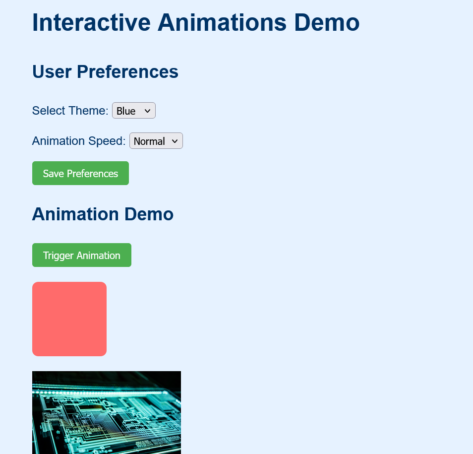

# CSS3 Transitions, Animations, and Advanced JavaScript Functions Project

## Project Description

This project demonstrates the use of CSS3 transitions and animations combined with advanced JavaScript functions to create interactive web elements. It includes user preference storage using localStorage and dynamic animation triggering based on user actions.

## Features

- **CSS3 Animations & Transitions**:
  - Smooth hover effects on buttons
  - Transform animations (scaling, rotation, translation)
  - Keyframe animations (bounce effect)
  - Adjustable animation speeds

- **JavaScript Functionality**:
  - Dynamic theme switching
  - Animation control
  - User preference management

- **Data Persistence**:
  - Save and load user preferences using localStorage
  - Maintain settings between page visits

## Project Structure

```
project-folder/
│
├── index.html          # Main HTML file
├── css/
│   └── styles.css      # CSS styles and animations
├── js/
│   └── script.js       # JavaScript functionality
└── images/             # (Optional) Folder for image assets
```

## Installation

No installation required. Simply open the `index.html` file in a modern web browser.

## Usage

1. **Set Preferences**:
   - Choose a theme (Light, Dark, or Blue)
   - Select animation speed (Slow, Normal, or Fast)
   - Click "Save Preferences" to store your settings

2. **Trigger Animations**:
   - Click the "Trigger Animation" button to:
     - Move and transform the colored box
     - Scale and rotate the image
     - Temporarily apply a bounce effect

3. **Persistent Settings**:
   - Your preferences will be remembered when you return to the page

## Customization

To customize the project:

1. **Add New Themes**:
   - Add new theme classes in `styles.css`
   - Add corresponding options in the theme select element in `index.html`

2. **Add New Animations**:
   - Create new CSS animations in `styles.css`
   - Add JavaScript event listeners in `script.js` to trigger them

3. **Change Storage Items**:
   - Modify the `userPreferences` object in `script.js` to store additional data

## Browser Support

The project uses modern web technologies that are supported in:
- Chrome (latest)
- Firefox (latest)
- Edge (latest)
- Safari (latest)

Note: Some animations might appear differently in older browsers.

## License

This project is open-source and available for educational purposes. Feel free to modify and use it as you see fit.

## Screenshot



## Credits

Created as a demonstration project for CSS3 animations and JavaScript functionality.